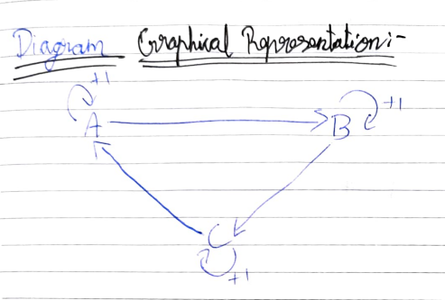

# MDP REPRESENTATION

## AIM:
To represent a Markov Decision Process (MDP) problem in the following ways:

1. Text representation
2. Graphical representation
3. Python - Dictionary representation

## PROBLEM STATEMENT:

### Problem Description
In this scenario, we consider an automatic robot vacuum cleaner tasked with cleaning dirt on the floor using mopping and vacuuming techniques, ensuring the room is free of any dirt.

### State Space
The state space represents the different states the robot can be in during its operation.
State Space Format:
{C, I} -> {0, 1}


Where,
- C -> Cleaning state
- I -> Idle state

### Sample State
For example, a sample state could be:
Sample State:
C -> 0


This denotes that the robot is in the cleaning state in state 0.

### Action Space
The action space comprises the set of actions the robot can take to clean the floor, including sweeping, vacuuming, and utilizing 2-DOF (Degrees of Freedom) movements.
Action Space Format:
{S, V, M} -> {0, 1, 2}


Where,
- S -> Sweep action
- V -> Vacuum action
- M -> Move action

### Sample Action
For instance, a sample action could be:
Sample Action:
V -> 1


This denotes that the robot performs a vacuum action in action 1.

### Reward Function
The reward function is designed to provide positive reinforcement for effective cleaning:
Reward Function:
R = { +1, when the floor is successfully cleaned,
0, otherwise}


### Graphical Representation


## PYTHON REPRESENTATION:
The Python representation below demonstrates the MDP as a dictionary structure.
```py
P = {
    0:{
        0: [(1.0,0,0.0,True)],
        1: [(1.0,0,0.0,True)]
    },
    1:{
        0: [(1.0,0,0.0,True)],
        1: [(1.0,2,1.0,True)]
    },
    2:{
        0: [(1.0,2,0.0,True)],
        1: [(1.0,2,0.0,True)]
    }
}

print(P)
```

## OUTPUT:
```py
{0: {0: [(1.0, 0, 0.0, True)], 1: [(1.0, 0, 0.0, True)]},
 1: {0: [(1.0, 0, 0.0, True)], 1: [(1.0, 2, 1.0, True)]},
 2: {0: [(1.0, 2, 0.0, True)], 1: [(1.0, 2, 0.0, True)]}}
```

## RESULT:
Thus, the given Markov Decision Process (MDP) problem is represented in the following ways:

1. Text representation
2. Graphical representation
3. Python - Dictionary representation